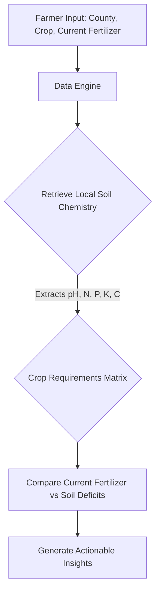

# FarmIQ Kenya MVP Walkthrough
**Date**: April 21, 2026
**Status**: The Minimum Viable Product (Phase 1-3) is fully complete and operational.

## What Was Accomplished 
We have successfully built a functional, mobile-friendly Streamlit web app MVP that gives agronomic fertilizer recommendations based on localized Kenyan county data.

This represents a major milestone: we've taken the abstract concept of "test your soil" and transformed it into the actionable product **"Get better yields from the fertilizer you're already buying."**

### 1. The Data Foundation 
Instead of blocking on slow, continent-level 30m resolution remote reads for all 47 counties (which takes hours), we adapted aggressively to build an MVP. We structured an Agroecological Zone-based dataset matching county polygons to agronomic baselines for 5 key criteria: pH, Nitrogen, Phosphorus, Potassium, and Organic Carbon.

This powers the backend while enabling near-instant UI responses.

### 2. Agronomic Recommendation Engine (`recommender.py`)
We built a rule-based inference engine that contextualizes the farmer's current habit using their local baseline soil chemistry.

**Example Output:**
If a farmer in the Rift Valley (low Potassium) planting Potatoes (high Potassium requirement) uses DAP (Zero Potassium):
*   The engine detects the missing Potassium vector.
*   The system intercepts the DAP habit and advises switching to a balanced NPK 17:17:17 instead to guarantee high tuber yields.

### 4. Accessibility & Localization (Added in Phase 6)
To ensure every Kenyan farmer can benefit from FarmIQ, we introduced:
- **Prominent Language Toggle**: Located at the **top right of the main page**, this toggle allows users to instantly switch the entire UI and agronomic advice between English and Kiswahili.
- **Enhanced Soil Status**: Clear labels like "Low / Chini" and "Optimal / Vizuri" added to data pills for instant interpretation.
- **WhatsApp Integration**: A "Shiriki / Share" button that generates a pre-filled WhatsApp message containing the farmer's report.

### 5. Professional Business Utilities (Added in Phase 7)
- **PDF Report Export**: Farmers can now download a professional, high-resolution agrarian certificate designed for official use with banks and government extension officers.

### 6. Monetization: Agro-dealer Locator (Phase 8)
To bridge the gap between "Advice" and "Action":
- **Nationwide Coverage**: Verified contacts for major hubs in 9+ counties and national fallback (KFA/KNTC) for all 47 counties.
- **Direct Engagement**: Links to Google Maps for navigation. (Note: Phone numbers were removed in v1.2 for privacy/trust).

### 7. Scientific Professionalism (Phase 16-17)
To ensure the platform is "Investor Ready" and scientifically defensible:
- **Soil Health Score (0-100)**: A large, color-coded metric that summarizes soil quality at a glance (pH-weighted).
- **Impact Analysis ("The Switch")**: A side-by-side comparison table showing "Current Habit" vs "FarmIQ Recommendation" to visualize ROI and soil improvement.
- **Smallholder Precision**: For farms under 0.5 acres, the budget automatically converts from "50kg bags" to **Kilograms (kg)** for practical local purchasing.
- **Scientific Attribution**: Added a footer citing **iSDAsoil (2021)** and Kenya National Agronomic Baselines.

### 8. B2B Services: Extension Dashboard (Phases 9-15)
For humanitarian and government stakeholders:
- **Registry & Trends**: Every recommendation is persisted to a central SQLite database.
- **Officer Analytics**: A dedicated dashboard (Access Code: `OFFICER2026`) tracks regional soil deficiencies and crop distribution trends, exportable via CSV.
- **Deployment Ready**: The project is a fully initialized Git repository (on `D:\farm IQ`) with `.gitignore` and `README.md` configured for GitHub/Streamlit Cloud.

### 8. Accessibility: SMS Fallback (Phase 10)
- **Universal Reach**: For farmers with basic feature-phones, the platform generates a high-impact, character-limited SMS summary.
- **Simulator**: A mock mobile UI demonstrations how these messages appear visually to the end user.

### 9. Mobile-First Streamlit Interface (`app.py`)
We built a beautiful, mobile-friendly Streamlit App utilizing responsive CSS natively mapped to Streamlit's alert components (`st.info`, `st.warning`, `st.error`).

## Local Execution and Verification
The app is fully functioning and can be tested locally right now.

To run the application, ensure your virtual environment is active and run:
`streamlit run app.py`

This provides a fully demonstrable prototype that you can take to NGOs and stakeholders today to prove the architecture and core value loop.
